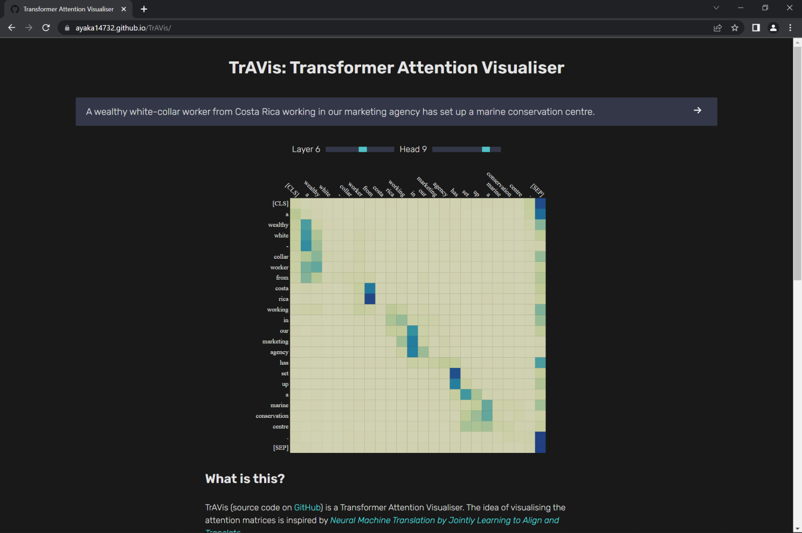

How we created an in-browser BERT attention visualiser without a server

## What is this?

TrAVis is a Transformer Attention Visualiser. The idea of visualising the attention matrices is inspired by [Neural Machine Translation by Jointly Learning to Align and Translate](https://arxiv.org/abs/1409.0473).

<!-- truncate -->

    

The original paper of the Transformer model was named [Attention Is All You Need](https://arxiv.org/abs/1706.03762), demonstrating the centrality of the attention mechanism to [Transformer-based models](https://huggingface.co/docs/transformers/model_summary). These models generate attention matrices during the computation of the attention mechanism, which indicate how the models process the input data, and can therefore be seen as a concrete representation of the mechanism.

In the [BERT](https://arxiv.org/abs/1810.04805) Base Uncased model, for example, there are 12 transformer layers, each layer contains 12 heads, and each head generates one attention matrix. TrAVis is the tool for visualising these attention matrices.

## Why is it important?

Despite the popularity of Transformer-based models, people often utilise them by just simply running the training scripts, ignoring what is going on inside the model. TrAVis helps us to better understand how Transformer-based models work internally, thus enabling us to better exploit them to solve our problems and, furthermore, giving us inspirations to make improvements to the model architecture.

## How did we do it?

The project consists of 4 parts.

Firstly, we [implemented](https://github.com/ayaka14732/bart-base-jax) the [BART](https://arxiv.org/abs/1910.13461) model from scratch using [JAX](https://github.com/google/jax). We chose JAX because it is an amazing deep learning framework that enables us to write clear source code, and it can be easily converted to NumPy, which can be executed in-browser. We chose the #BART model because it is a complete encoder-decoder model, so it can be easily adapted to other models, such as BERT, by simply taking a subset of the source code.

Secondly, we [implemented](https://github.com/ztjhz/word-piece-tokenizer) the [HuggingFace BERT Tokeniser](https://huggingface.co/docs/transformers/model_doc/bert#transformers.BertTokenizer) in pure Python, as it can be more easily executed in-browser. Moreover, we have optimised the tokenisation algorithm, which is faster than the original HuggingFace implementation.

Thirdly, we use [Pyodide](https://pyodide.org) to run our Python code in browser. Pyodide supports all Python libraries implemented in pure Python, with [additional support](https://pyodide.org/en/stable/usage/packages-in-pyodide.html) for a number of other libraries such as NumPy and SciPy.

Fourthly, we visualise the attention matrices in our web application using [d3.js](https://d3js.org/).

## Result

The result is that our Transformer model can run entirely in the browser without the need of a server.

When users input sentences into our web application, the loaded model will generate the attention matrices of the sentences, which will then be visualised as a heatmap. Subsequently, users can select which Transformer layer and attention head to visualise, by utilising the range slider.

## Source code

The source code of our visualiser is published on GitHub

import GithubUser from "@site/src/components/GithubUser";

## The team

    <GithubUser name="Jing Hua" url="https://github.com/ztjhz" />
    <GithubUser name="Ayaka" url="https://github.com/ayaka14732" />

