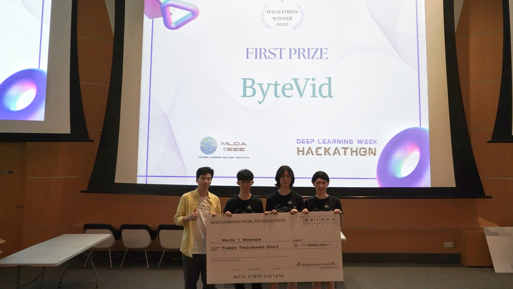
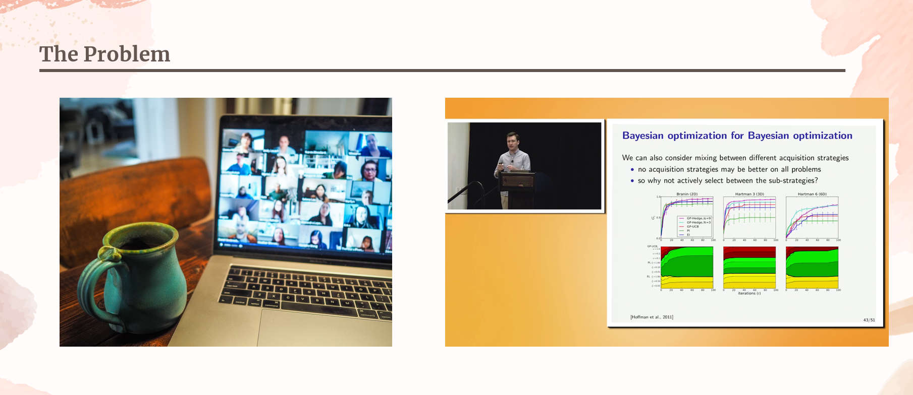
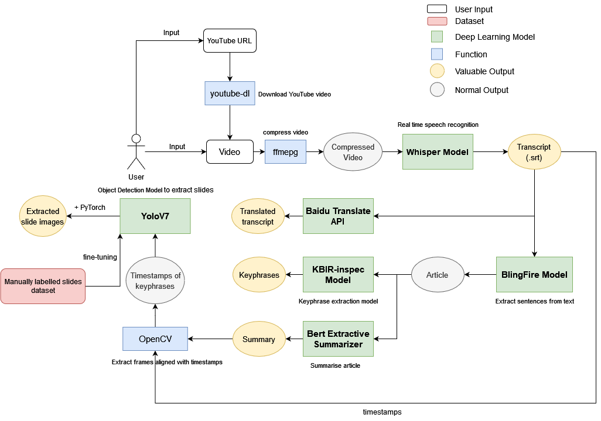
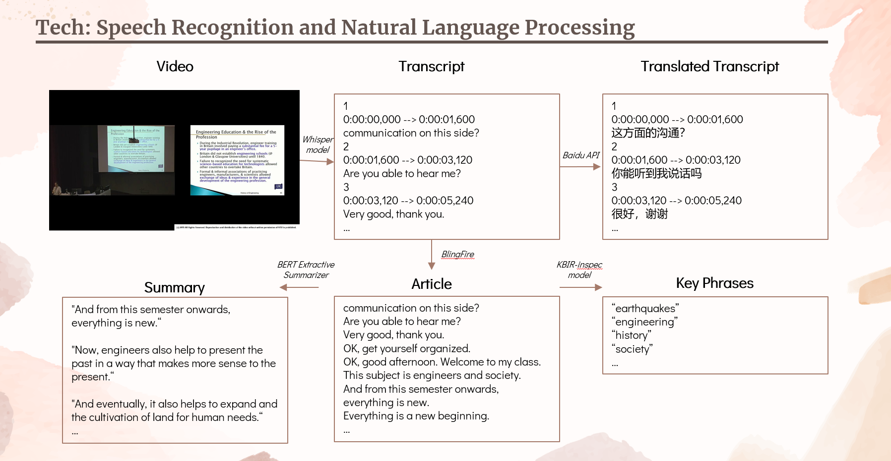
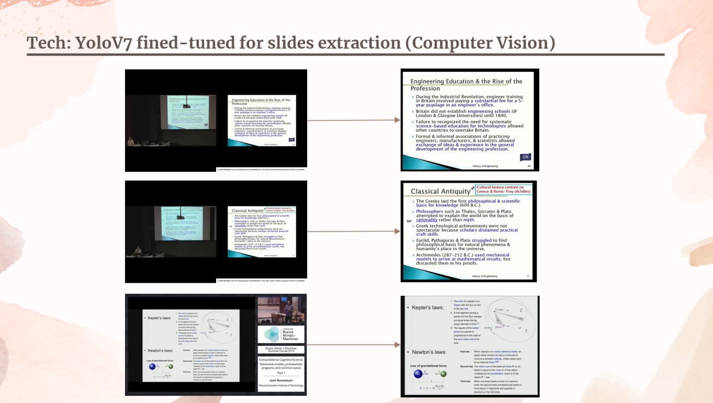
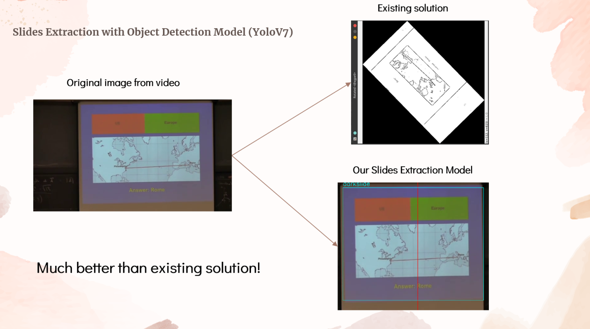
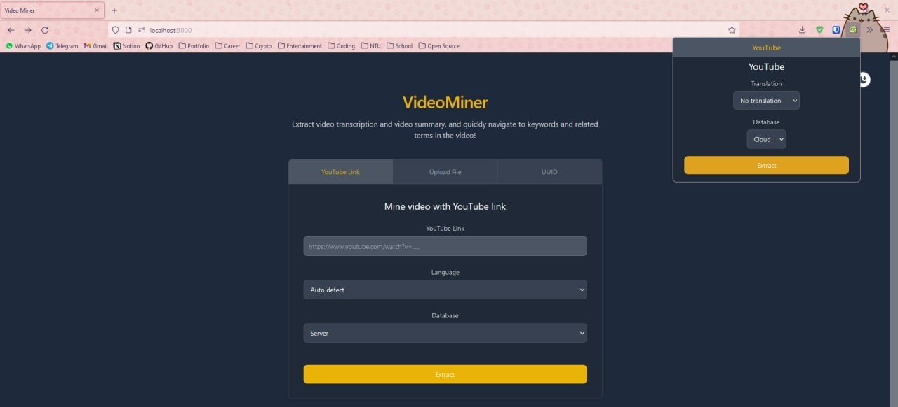

## Say goodbye to long and boring videos! 👋

:::info
Powered by the cutting-edge deep learning technologies in 2022, ByteVid transforms long, boring videos into fun byte-sized content. Be it a one hour long lecture, or a 30-minute zoom meeting, ByteVid can transcribe, summarise the content, extract keywords, detect and extract important slides from the video, and translate into other languages.
:::

<!-- truncate -->

> Over the weekend (1 Oct 2022 - 3 Oct 2022), our team comprising of [Jing Hua](https://github.com/ztjhz), [Jing Qiang](https://github.com/xjqx), and [Ayaka](https://github.com/ayaka14732), participated in the MLDA Deep Learning Week Hackathon 2022. We worked tirelessly through exhausting days and sleepless nights, to come up with ByteVid in 48 hours. We went through 2 rounds of pitching and eventually came out on top and finished 1st out of 120 teams 🥇. Here is how we did it...

## Inspiration

    

When we first encounter the topic of ‘AI and Smart Nation’, we were extremely excited as there were tons of areas that we could explore. Mobility, healthcare, media and entertainment, agriculture, social, sustainability, etc. Hours and hours of time were spent on finding something that intrigue us, but we were unsuccessful. How can we balance our skills and aspirations with the problem we want to work on?

The idea struck upon us as we went back to our roots as ‘students’. With Singapore’s effort in promoting Smart Nation, online recorded lectures and meetings are becoming increasingly prevalent. We struggled with online recorded lectures and meetings because it was difficult to understand what the other person was saying. Some spoke in non-native languages. Some spoke with abnormal accents. While some don’t even provide slides for us students to follow the lecture with. We struggled even more given that an average audience attention span is about 7 minutes, and that current Zoom transcription feature is not so accurate. We could not understand the video content properly and with comfort 😥

Therefore, we were inspired and motivated to build a project that will help us, and others extract video information efficiently!

## The plan

We got to the drawing board and planned for hours on what features we needed and how we could get there. This is what we came up with:

1. We first obtain the video file from the user, either directly or through a YouTube link. If the user supplies a YouTube Link, we utilise [youtube-dl](https://github.com/ytdl-org/youtube-dl) to download the video on to our server.

1. We then use ffmepg to compress and speed up the video by 1.6x to optimise the performance of the speech recognition model.

1. The compressed video is then passed into [Whisper](https://github.com/openai/whisper), a state-of-the-art (SOTA) speech recognition model, generating a `transcript`.

1. Sentences are extracted from the `transcript` using the [BlingFire](https://github.com/microsoft/BlingFire) model to generate an `article`. At the same time, the `transcript` is translated into various languages using [Baidu Translate API](https://api.fanyi.baidu.com/doc/21).

1. The article is then passed into the [KBIR-inspec](https://huggingface.co/ml6team/keyphrase-extraction-kbir-inspec) model, which extracts `key phrases`, and the [Bert Extractive Summarizer](https://pypi.org/project/bert-extractive-summarizer/), which generates a `summary`.

1. With the `summary` and the `timestamps` from the transcript, we utilise OpenCV to extract `images` from the video of each sentence in the summary.

1. With the images, we pass it into our [YOLOv7](https://github.com/ztjhz/yolov7-slides-extraction), a SOTA object detection model that we fine-tuned with manually labelled data, to generate `slide images`.

## Seeing it in action

### Speech recognition and natural language processing

This is how our speech recognition and natural language processing looks like in action:

Using 4 different deep learning models and a translation API, the video is transcribed, translated, and transformed into an article, summarised, and extracted into key phrases.

### Slides extraction using computer vision

This is how our slides extraction using computer vision looks like in action:

As you can see, the slides have been extracted from the video.

:::info
In fact, our slides detection model is even better than existing solution!

:::

To achieve such an amazing result, we had to fine-tune the YOLOv7 model for lecture slides detection. To do that, we downloaded a diverse dataset of 200 lecture videos, ranging from computer science lectures, to business seminars, and to zoom meetings. We then manually labelled each and everyone of them using using a [labelling software](https://github.com/Cartucho/OpenLabeling). Subsequently, we trained our [own lecture slides detection model](https://github.com/ztjhz/yolov7-slides-extraction) on our GPU server, and achieved fantastic results!

## Bringing ByteVid to the user

### Frontend

To make our solution easily accessible to the user, we created a [web application](https://github.com/xJQx/ByteVidFrontend) (built with `React.js` and `Tailwindcss`, and deployed on `GitHub` pages) as well as a [browser extension](https://github.com/ztjhz/ByteVidExtension):

The web application features an intuitive user interface, where users are allowed to choose to submit a YouTube link or upload a video file. The language of the video and the translation language of the transcript can also be customised to their liking.

### Backend

Our [backend](https://github.com/ayaka14732/ByteVid) utilises a `Flask` server, which is deployed to a GPU machine. Since our GPU machine has no Internet access, we set up a relay server with autossh port forwarding to relay our GPU server port to an Internet-facing VPS. We then utilised Nginx reverse proxy to intergrate our GPU server to our existing web service API. We also utilised Cloudflare for site protection.

### The result

Here is a demo of our live website:

import ReactPlayer from 'react-player/lazy';

<ReactPlayer url="https://www.youtube.com/watch?v=nhGbsUXVtRA" width="100%" wrapper="p" />

### Source code

- [ByteVid](https://github.com/ayaka14732/ByteVid)
- [ByteVid Front-end](https://github.com/xJQx/ByteVidFrontend)
- [ByteVid Extension](https://github.com/ztjhz/ByteVidExtension)
- [ByteVid YOLOv7 Slides Extraction](https://github.com/ztjhz/yolov7-slides-extraction)

## The benefits

ByteVid comes with several benefits:

1. It works for both business zoom meetings and recorded school lectures, saving time and energy in watching long videos.

1. Our translation can overcome language and accent barriers, allowing businesses to enhance their overseas inter-racial collaboration, and students to learn from any lectures of any languages.

1. Our extracted summary and slides serve as a template for both business executives and students to build notes upon.

## Deep learning models used

1. [Whisper](https://github.com/openai/whisper): SOTA speech recognition (Sep 2022)
1. [YOLOv7](https://github.com/WongKinYiu/yolov7): SOTA object detection (Jul 2022)
1. [KBIR-inspec](https://huggingface.co/ml6team/keyphrase-extraction-kbir-inspec): key phrase extraction (Dec 2021)
1. [Bert Extractive Summarizer](https://pypi.org/project/bert-extractive-summarizer/): summarisation (Jun 2019)
1. [BlingFire](https://github.com/microsoft/BlingFire): sentence extraction
1. [Baidu Translate API](https://api.fanyi.baidu.com/doc/21): translation

## Reflection

### Accomplishments that we’re proud of

- Building and deploying a fully functional AI product in less than 2 days
- Our products are a combination of three exciting fields of AI: computer vision, natural language processing and speech processing
- We build our own lecture slides dataset and CV model that is better than existing solutions

### Challenges

- There is no existing solution for lecture slides detection - we manually labelled hundreds of videos and images to train our own lecture slides detection model.
- Our GPU server has no Internet access - we set up a relay server with autossh port forwarding.
- The ffmpeg commands were complicated - when we finally succeeded in demystifying them, we feel a sense of achievement.
- The speech recognition model is relatively slow - we noticed that professors usually speak slowly, so we optimised the performance by speeding up lecture videos by 1.6x before passing them into the speech recognition model.
- We used up our Baidu translation API free quota during testing - we paid S$10 to buy extra quota.
- The Baidu translation API has a rate limit - we split paragraph into chunks of sentences and request at a moderate speed.
- There is no simple method to split paragraphs into sentences (e.g. 3.14 will become two sentences when split by periods) - we utilised the BlingFire model to solve this problem.

### What we learned

- Deploying deep learning models on cloud server
- Speech knowledge for speech recognition and video transcription
- NLP knowledge for machine translation, summarisation and keyword extraction
- CV knowledge for object detection and lecture slide extraction
- Developing a browser extension

## What’s next for ByteVid

- Auto-navigation to certain timestamps in videos based on keywords
- Increase support for other URLs other than YouTube
- Implement a Telegram bot
- Implement a mobile application

## References

[1] A. Radford, J. W. Kim, T. Xu, G. Brockman, C. McLeavey, and I. Sutskever, “Robust Speech Recognition via Large-Scale Weak Supervision,” 2022.

[2] C.-Y. Wang, A. Bochkovskiy, and H.-Y. M. Liao, “YOLOv7: Trainable bag-of-freebies sets new state-of-the-art for real-time object detectors,” arXiv preprint arXiv:2207.02696, 2022.

[3] M. Kulkarni, D. Mahata, R. Arora, and R. Bhowmik, “Learning rich representation of keyphrases from text,” arXiv preprint arXiv:2112.08547, 2021.

[4] D. Miller, “Leveraging BERT for extractive text summarization on lectures,” arXiv preprint arXiv:1906.04165, 2019.

import GithubUser from "@site/src/components/GithubUser";

## The team

    <GithubUser name="Jing Hua" url="https://github.com/ztjhz" />
    <GithubUser name="Ayaka" url="https://github.com/ayaka14732" />
    <GithubUser name="Jing Qiang" url="https://github.com/xjqx" />

