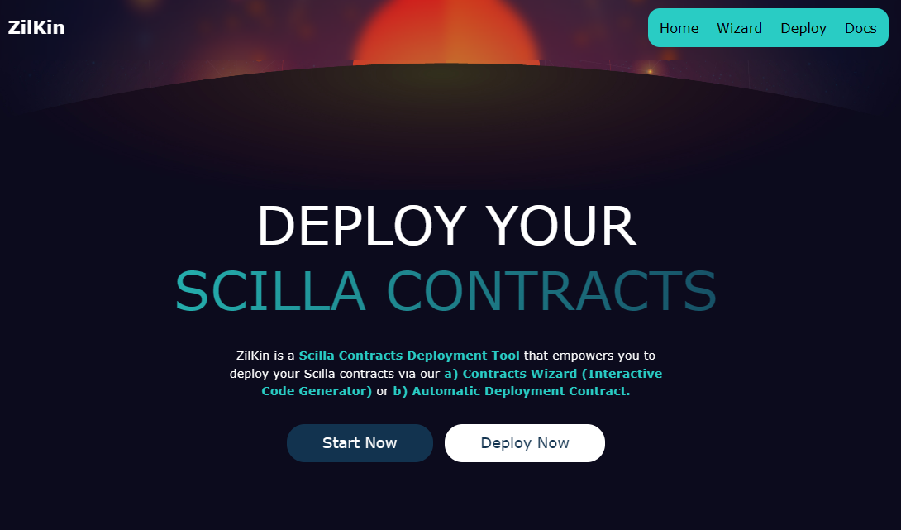
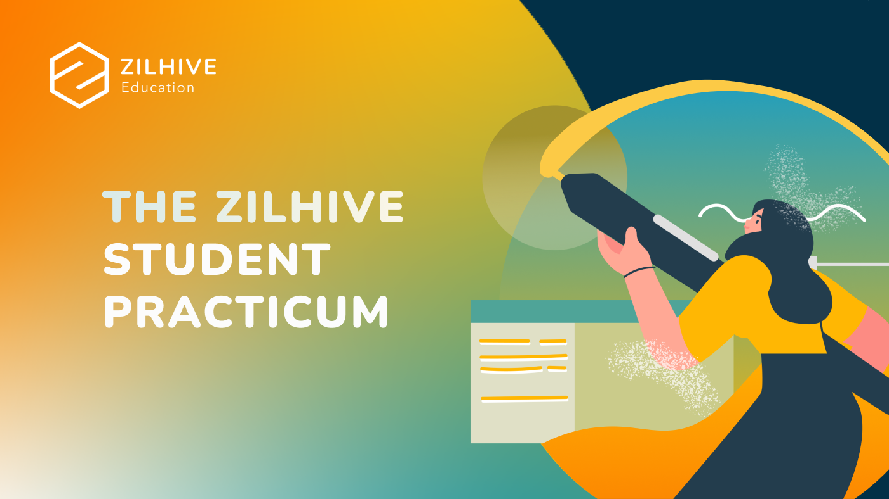
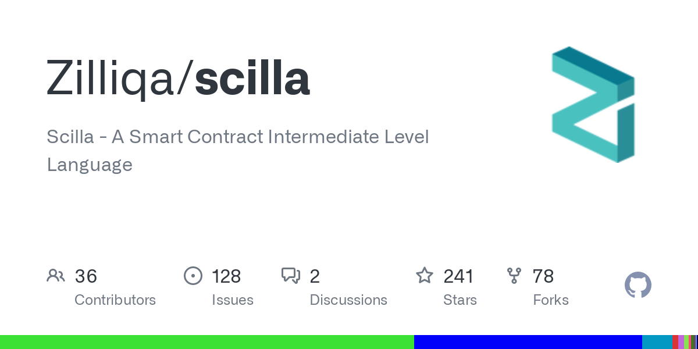
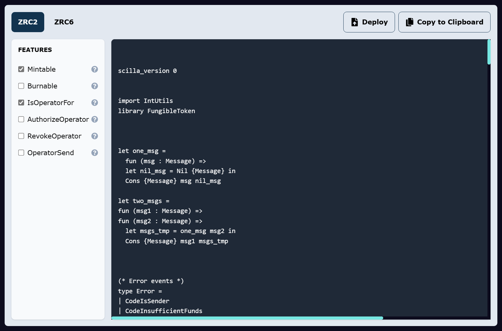

:::info
ZilKin is a Scilla Contracts Deployment Tool that empowers you to deploy your Scilla contracts effortlessly via our a) Contracts Wizard (Interactive Code Generator) or b) Automatic Deployment Contract.
:::

<!-- truncate -->

> Over the 2022 Winter (Dec 2022 - Jan 2023), I was beyond thrilled to have been handpicked as one of the **elite 20** undergraduate students from the APAC region to participate in the highly acclaimed [ZilHive Student Practicum](https://www.zilhive.org/zilhive-student-practicum/). This program was an absolute game-changer for me, providing me with unparalleled opportunities to immerse myself in the world of cutting-edge blockchain and Web3 development.

## The Spark of Inspiration

As a developer, I am driven by the burning passion to craft solutions that not only simplify the lives of my peers but also reshape the world as we know it. That's why, when I was privileged to be a part of the infrastructure track at the ZilHive Student Practicum, I knew that this was a chance to leave an indelible mark on the developer community. My objective was to conceive a tool that would make the process of deploying Scilla smart contracts a breeze, and accessible for developers of all skill levels.

The inspiration for this idea came to me when I realized that [Scilla](https://scilla-lang.org/), a powerful and versatile language, was often underutilized due to its complexity and lack of resources. I realized that if I could create a tool that would make it easy for developers to deploy Scilla smart contracts, it would have a transformative impact on the developer community.

## Building a Masterpiece

To bring this idea to life, my team and I decided to harness the power of React, tailwindcss, and Scilla. [React](https://github.com/facebook/react), a widely adopted JavaScript library, was chosen for its user-friendly interface, while [tailwindcss](https://github.com/tailwindlabs/tailwindcss), a CSS framework, was used to infuse elegance and aesthetic appeal to the tool. [Scilla](https://github.com/Zilliqa/scilla), a smart contract language, was chosen for its powerful features and versatility. However, to fully grasp Scilla and create a successful solution, I had to immerse myself in the language, learning about smart contracts and the intricacies of the Scilla language. It was a challenging but enlightening journey.

## Unveiling Zilkin: A Revolutionary Scilla Smart Contracts Deployment Tool

After a journey of tireless dedication and relentless innovation, my team and I stand before you, beaming with pride as we unveil [Zilkin](https://zilkin.tjh.sg/) - a revolutionary tool that shatters the barriers of Scilla smart contract deployment. With our state-of-the-art [Contracts Wizard](https://zilkin.tjh.sg/contracts-wizard) (Interactive Code Generator) and [Automatic Contract Deployment](https://zilkin.tjh.sg/deploy) feature, we have empowered developers to effortlessly weave their ideas into the fabric of the Zilliqa ecosystem with unprecedented ease and speed.

## Unveiling the Future of Scilla

As I stood before the esteemed mentors and fellow developers of ZilHive, my team and I knew we were presenting something truly special. When we unveiled our solution, a tool of unparalleled elegance and simplicity, it was met with gasps of wonder and applause. The user-friendly interface, intuitive design, and ease of use had captivated the audience, and they could see the potential impact it could have on the developer community. With its revolutionary capabilities, this tool would change the game, ignite a new era of development, and empower a new generation of developers to bring their wildest dreams to life. Zilkin is not just a tool, but a bridge to a brighter future, where the complexities of Scilla are no longer a barrier, and the true potential of the Zilliqa ecosystem can be fully realized!

## A New Era of Scilla

I am proud that our innovation has become a beacon of hope, a shining light that illuminates the path to a brighter future for Scilla. It is a revolutionary tool that will make the deployment of Scilla smart contracts as effortless as a gentle breeze on a warm summer's day. It will empower developers, both the seasoned veterans and the eager newcomers, to harness the full potential of Scilla's power and versatility. With this solution, the horizon for Scilla is limitless and the possibilities are endless. I am honored to be a part of this transformative change that will shape the developer community for years to come and pave the way for a new era of innovation in the world of Scilla.

## Mentored by the Masters

With gratitude in my heart, I extend my deepest thanks to the esteemed mentors of Zilliqa - [Kevin Meyer](https://www.linkedin.com/in/kevin-meyer-44016399/), [Tom Fleetham](https://www.linkedin.com/in/tom-fleetham-34579122/), [Elliott Green](https://www.linkedin.com/in/elliottgreencompsci/), and [Bradley Laws](https://www.linkedin.com/in/bradley-laws-aa23aa19/) - for their unwavering guidance and support. My journey would not have been possible without their invaluable wisdom and expertise. I am also forever grateful to the brilliant trainer, [Wei-Meng Lee](https://www.linkedin.com/in/leeweimeng/), for imparting his knowledge and skills to me and helping me to reach new heights. Their mentorship has been a true blessing, and I am eternally grateful for the opportunity to learn from such esteemed individuals in the industry.

## The Bridge to a Brighter Future

As I look back on the journey that led me to the creation of Zilkin, I am filled with a sense of wonder and gratitude. The road was long, and the challenges were many, but the rewards have been immeasurable. I have not only developed a tool that will change the way Scilla smart contracts are deployed, but I have also grown as a developer and as a person.

Through the mentorship and guidance of the esteemed Zilliqa team, I have been able to tap into my full potential and create something truly special. The future is bright for Scilla and the developer community, and I am honored to have played a small part in that.

As the future unfolds, I can't wait to see the impact Zilkin will have and the doors it will open for developers everywhere. This is just the beginning of a new era, where the power of Scilla will be accessible to all and the true potential of the Zilliqa ecosystem will be fully realized. Thank you for joining me on this journey, and I look forward to seeing where Zilkin will take us next.

## Links

- [Source code](https://github.com/xJQx/zilkin)
- [Website](https://zilkin.tjh.sg/)

import GithubUser from "@site/src/components/GithubUser";

## The team

    <GithubUser name="Jing Hua" url="https://github.com/ztjhz" />
    <GithubUser name="Jing Qiang" url="https://github.com/xjqx" />

